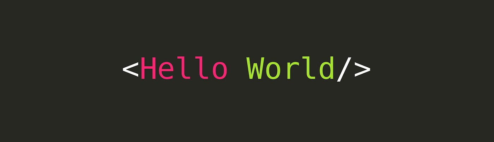

# RISC-V bare metal Hello World

## QEMU
This code uses Qemu emulator to emulate a virtual hardware to run our program, to install Qemu which could be found here:
https://github.com/qemu/qemu

## TOOLCHAIN
Also it uses RISCV toolchain to compile the code and link the script files:
https://github.com/riscv-collab/riscv-gnu-toolchain

## How to Run?
